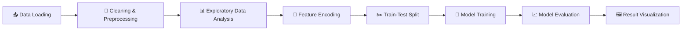

<div align="center">

# 🛡️ Network Intrusion Detection using Machine Learning

### Detecting Malicious Network Traffic with Classical ML Models on the NSL-KDD Dataset


</div>

---

## 📖 Overview

Network intrusions are one of the most persistent threats to modern IT infrastructure. This project applies **supervised machine learning** to the benchmark **NSL-KDD dataset** to classify network traffic as either **normal** or **malicious (attack)**.

The pipeline covers everything from raw data ingestion to model comparison — data cleaning, exploratory data analysis (EDA), feature encoding, model training, and rigorous evaluation using multiple performance metrics.

---

## 🎯 Objectives

- 🔍 Perform in-depth exploratory analysis of the NSL-KDD dataset
- 🤖 Build and train machine learning classifiers to detect intrusions
- 📊 Compare model performance using standard classification metrics
- 📈 Visualize results for clear, interpretable insights

---

## 📂 Dataset

| Detail | Description |
|---|---|
| **Name** | NSL-KDD |
| **Type** | Network traffic records (normal & attack categories) |
| **Source** | [Kaggle — NSL-KDD Dataset](https://www.kaggle.com/datasets/williamson5/nsl-kdd-dataset) |
| **Task** | Binary / Multi-class Classification |

> The NSL-KDD dataset is an improved version of the original KDD'99 dataset, with redundant records removed to provide a more realistic benchmark for intrusion detection research.

---

## 🛠️ Technologies Used

| Category | Tools |
|---|---|
| **Language** | Python |
| **Data Handling** | Pandas, NumPy |
| **Visualization** | Matplotlib, Seaborn |
| **Machine Learning** | Scikit-learn |
| **Environment** | Google Colab |

---

## 📊 Project Workflow



1. **Data Loading** — Import the NSL-KDD train/test sets
2. **Data Cleaning & Preprocessing** — Handle missing values, duplicates, and inconsistencies
3. **Exploratory Data Analysis (EDA)** — Understand feature distributions and attack-class balance
4. **Feature Encoding** — Convert categorical features into numerical form
5. **Train-Test Split** — Partition data for unbiased evaluation
6. **Model Training** — Fit classical ML models on the processed data
7. **Model Evaluation** — Assess performance using multiple metrics
8. **Result Visualization** — Plot and interpret the outcomes

---

## 🤖 Machine Learning Models

| Model | Description |
|---|---|
| 🌳 **Decision Tree** | A simple, interpretable baseline classifier |
| 🌲 **Naive Bayes** | To analys the heat map |

---

## 📈 Evaluation Metrics

- ✅ **Accuracy**
- 🎯 **Precision**
- 🔁 **Recall**
- ⚖️ **F1 Score**
- 🧮 **Confusion Matrix**
- 📉 **ROC Curve**
- 📊 **Precision-Recall Curve**

---

## 📁 Repository Structure

```
📦 Network-Intrusion-Detection
├── 📂 data/            # Raw and processed dataset files
├── 📂 notebooks/       # Google Colab for each pipeline stage
├── 📂 images/          # Generated plots and visualizations
├── 📄 README.md        # Project documentation
└── 📄 requirements.txt # Python dependencies
```

---

## 🚀 Results

> 🏆 **Random Forest outperformed Decision Tree**, achieving lower accuracy but balanced classes— not suitable to applu machine learning algorithms.

---

## 🔮 Future Improvements

- 🎛️ **Hyperparameter Tuning** — Optimize models via Grid Search / Random Search
- 🧬 **Feature Selection** — Reduce dimensionality and improve efficiency
- ⚡ **Advanced Models** — Experiment with **XGBoost** and **LightGBM**
- 🌐 **Deployment** — Wrap the best model in a simple API or dashboard for real-time detection

---

## 👤 Author

**Nusrat Jahan Jannat**

<div align="center">

⭐ If you found this project useful, consider giving it a star!

</div>
